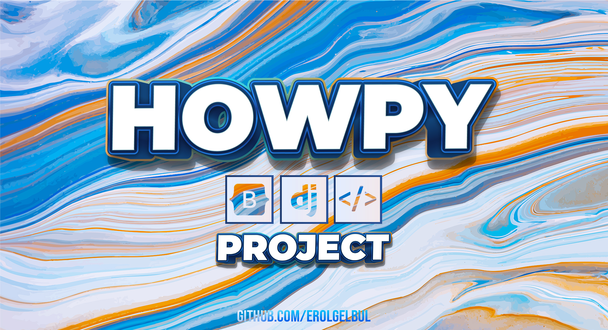
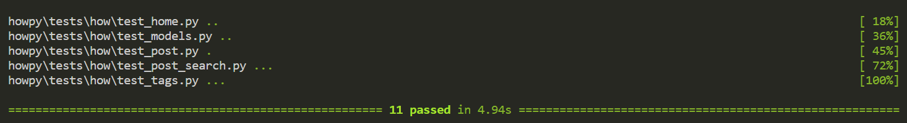

<div id="top"></div>

<div style="text-align:center"></div>

## 1. Introduction

### 1.1 Overview

<ins>Purpose</ins>: The purpose of this project is to provide a platform for
displaying algorithms using a programming language. This instance of the project
is called "Howpy" and it displays Python algorithms.

<ins>Target Audience</ins>: Developers, engineers, students.

<div style="text-align:center"></div>

<ins>Features</ins>
- Algorithm Page
- Tags (Algorithm Categories)
- Tag Page
- Admin Page
- Search Bar


## 2. Getting Started

### 2.1 Tech Stack

Front-end: Bootstrap, HTMX

Back-end framework: Django

RDBMS: SQLite

Testing Framework: pytest

### 2.2 Installation

#### 2.2.1 Install Python

<ins>Windows</ins> 

1. Go to the official Python website:
[Python](https://www.python.org/downloads/windows/)
2. Download the latest version of Python for Windows by clicking on the
   "Download Python" button. Choose the version that is appropriate for your
   system (32-bit or 64-bit).
3. Open the downloaded installer and follow the installation wizard. Make sure
   to select the option "Add Python to PATH" during the installation process.

<ins>MacOS</ins> 

1. Go to the official Python website:
[Python](https://www.python.org/downloads/windows/)
2. Download the latest version of Python for Windows by clicking on the
   "Download Python" button. Choose the version that is appropriate for your
   system (32-bit or 64-bit).
3. Open the downloaded installer and follow the installation wizard. Make sure
   to select the option "Install for all users" and "Add Python to PATH" during
   the installation process.

<ins>Linux</ins> 

1. Open a terminal window.
2. Use the package manager for your Linux distribution to install Python. For
   example, on Ubuntu and Debian, you can use the command `sudo apt-get install
   python3` to install Python 3.
3. Verify that Python is installed by running the command `python3 --version` in
   the terminal. If Python is installed correctly, you should see the version
   number of Python that you installed.


#### 2.2.2 Install & Activate Virtual Environment

Depending on how you want to use this project, you may want to run it locally on
your machine. If so follow the steps on this section:

1. Install virtualenv: Once you have installed Python, you can install virtualenv using pip. Open your
terminal (Command Prompt for Windows) and type:
```bash
pip install virtualenv
```

<ins>MacOS & Linux</ins>

2. Create a virtual environment: To create a virtual environment, go to the
directory where you want to create it and run the following command:

```bash
virtualenv myenv
```
Here, myenv is the name of the virtual environment. You can choose any name you
want.

3. Activate the virtual environment: To activate the virtual environment,
run the following command:

```bash
source myenv/bin/activate
```

<ins>Windows</ins>

On Windows, the command is slightly different:

```bash
myenv\Scripts\activate.bat
```


#### 2.2.3 Install Requirements

1. Open the command prompt
2. Navigate to the directory that contains the requirements.txt file.
3. Run the following command:


```bash
pip install -r requirements.txt
```

## 2.2.4 Prepare Django SECRET_KEY

You can store the SECRET_KEY by creating a `.env` file. For security reason,
it is important to secure the SECRET_KEY, that's why this project does not
provide you one.

You may create a SECRET_KEY manually by following the steps:

1. Open a Python shell in your Django project's root directory.

```bash
python manage.py shell
```

2. Once in the Python shell, run the following command to import the
`get_random_secret_key` function:

```bash
from django.core.management.utils import get_random_secret_key
```

3. Then, run the following command to generate a new SECRET KEY:

```bash
get_random_secret_key()
```

This will return a new SECRET KEY.

4. Finally, copy the new SECRET KEY and paste it into your Django project's
settings file (e.g. `settings.py`) as the value of the `SECRET_KEY` variable.

For example:

```bash
SECRET_KEY = 'your_new_secret_key_here'
```

Save the changes to your settings.py file and exit the Python shell.


## 2.2.5 Run on Local Server

Run inside the directory containing `manage.py` file:

```bash
python manage.py runserver
```

## 2.2.5 Run the migrations

Prepare:

```bash
python manage.py makemigrations
```

Run:

```bash
python manage.py migrate
```


<p align="right">(<a href="#top">back to top</a>)</p>


## 3. Architecture

### 3.1 Project Directory

<div style="text-align:center"></div>

<ins>urls.py</ins>

When a user requests a particular URL from a Django web application, the web server sends the request to the Django application. The urls.py file then maps the requested URL to the appropriate view function that will handle the request and generate a response.

The urls.py file consists of a series of URL patterns. Each pattern defines a particular URL that the application should handle and maps it to a view function that generates a response for that URL.

<ins>templates/</ins>

In a Django application, views are responsible for generating dynamic content, while templates define how that content should be presented to the user. Templates allow developers to separate the presentation logic from the application logic, making it easier to maintain and update the web application.

When a view function is called, it typically renders a template to generate an HTML response. The template may include placeholders for dynamic content, such as variables or loops, which are replaced with actual values at runtime.

### <ins>Template Structure</ins>

For a clean structure, the boilerplate .html files are separated from the app
specific components. `base/` directory has the boilerplate code, whereas `how/`
directory contains the app code. Important notes for the `base/` directory:

`base.html`: in a Django project is a template file that serves as a base or parent template for other templates in the project. It typically contains the common structure and layout of the web pages, such as the HTML boilerplate, CSS and JavaScript files, and navigation menu.

When you create a new template for a specific page in your Django application, you can inherit the structure and layout from the base.html file by including the  template tag at the top of the file. This tells Django to use the base.html file as the parent template and to insert the content of the child template in the appropriate place in the parent template.

`3-col-template.html`: adds a specific layout for a three-column web page. The
three columns are defined using Bootstrap's grid system. The layout is as
follows:

<div style="text-align:center"></div>

The `how/` directory:

`components/`: self-explanatory directory, where the small parts of the webpage
is stored, such as, the `search-bar.html`, `tag-cloud.html` that displays the
tags. Additionally, the `splash.html` for the homepage. `post-list-elements...`
are used for listing posts according to the need (for search, for tag, for main page).

`single.html`: is used for a single post page.

`static/` directory only has a single `.css` file called `main.css` inside the
`css/` directory. The images are also stored in here.

`settings/` directory contains the base settings config and 2 extra files
called: `local.py` and `production.py`. You can add and alter settings as you
wish during development with `local` and make your changes ready for production with
`production`.

`tests/` are discussed in Section 5.

### 3.2 App Directory

<div style="text-align:center"></div>

`templatetags/` directory there are 2 files:

1. `tag_cloud.py`: defines a custom template tag for a Django app called "How".
   The purpose of this tag is to generate a tag cloud for the app using the Tag
   model from the third-party Django package django-taggit. The how/components/tag-cloud.html template can then be customized to display the tag cloud in the desired format.
2. `markdown_processing.py`: is another custom template tag for the same app.
   The purpose of this filter is to process Markdown-formatted text and convert
   it into HTML. The resulting HTML can then be used in the template to display
   the formatted text. This custom filter can be used to render user-generated
   content in a Django app, such as blog posts or comments, in a formatted and
   visually appealing way.

`apps.py` file inside a Django app folder is a Python module that contains the
configuration for the app. The purpose of this file is to define the
configuration options for the app, such as the name and the default auto field
for the models in the app.

`forms.py` file in the app folder defines a PostSearchForm class that inherits
from forms.Form, which means it is a regular form that is not tied to any model.
The purpose of this form is to provide a search functionality for posts. The
PostSearchForm class has a single field called q, which is a CharField that
represents the search query.

In the __init__ method of the form, the q field is updated to include the class attribute "form-control". This attribute specifies the Bootstrap CSS class that is used to style the search box.

The PostSearchForm can be used in a Django view to handle user input when performing a search for posts. The form data can be accessed and processed in the view using the request.POST object.

`models.py` file in a Django app folder defines the data models used in the app.

The purpose of this file is to define the structure and behavior of the app's
data. In other words, it defines how the data is stored, retrieved, and
manipulated in the app.

The models.py file defines a Post model that inherits from models.Model. The
Post model represents a post that is going to display each algorithm and has
fields for the post's title, subtitle, author, content, creation date, and
update date.

The Post model also has a tags field that uses the TaggableManager from the
django-taggit package to manage tags associated with the post.

`urls.py` defines the app's URL patterns:

The first path matches the root URL. If you decided to name your website
"howpy.com", this path will show that url.
```python
path("", views.HomeView.as_view(), name="homepage"),
```

This path matches the post search functionality. For instance, "howpy.com/search/".
```python
path("search/", views.PostSearchView.as_view(), name="post_search"),
```

This is the URL for a single algorithm post. This is the only Function-based
view. Example: "howpy.com/binary-search/".
```python
path("<slug:post>/", views.post_single, name="post_single"),
```

This path will give you algorithms with a specific tag. Example: "howpy.com/tag/search/".
```python
path("tag/<slug:tag>/", views.TagListView.as_view(), name="post_by_tag"),
```

`views.py` file:

1. <ins>HomeView</ins>: This is a class-based view that inherits from ListView. It retrieves all Post objects from the database and paginates them. The get_template_names method determines the template to be used based on whether the request is an Htmx request or not.

2. <ins>post_single</ins>: This is a function-based view that retrieves a single Post object based on the slug parameter in the URL. If the Post object is found and its status is "published", it is rendered using the "how/single.html" template along with a list of related Post objects from the same author.

3. <ins>TagListView</ins>: This is a class-based view that inherits from ListView. It retrieves all Post objects that have a particular tag specified in the URL and paginates them. The get_template_names method determines the template to be used based on whether the request is an Htmx request or not. The get_context_data method adds the tag to the context so that it can be used in the template.

4. <ins>PostSearchView</ins>: This is a class-based view that inherits from ListView. It retrieves all Post objects that have a title containing the search query specified in the URL and paginates them. The get_template_names method determines the template to be used based on whether the request is an Htmx request or not. The form_class attribute specifies the form used to process the search query.


`admin.py` is used to register models with the Django admin site.


<p align="right">(<a href="#top">back to top</a>)</p>

## 4. Functionalities

### 4.1 Listing Algorithms

<p align="center">
  
</p>

#### 4.1.1 HTMX Pagination

Pagination is available on every page that may reveal set of items, such as: the
homepage, tagpage, searchpage.

<div style="text-align:center"></div>

How does pagination work?

<div style="text-align:center"></div>

Made using [ZenFlowchart](https://www.zenflowchart.com/)

#### 4.1.2 Layout Adaptation

The webpage automatically adjusts when the page shrinks, which means the layout
and elements will adapt to fit smaller screen sizes. This functionality is made
possible by Bootstrap's responsive design features.

#### <ins>1100px x 720px</ins>
<p align="center">
  
</p>

#### <ins>600px x 720px</ins>
<p align="center">
  
</p>


### 4.2 Algorithm Page

#### 4.2.2 Markdown Editing

<p align="center">
  
</p>

Now the very cool part of this feature is that, the user has a main "code" field
inside that database and that codebox is auto highlighted by "highlight.js"
which is revealed at the start of the page with its own styling. If the user
decided to show more code after some text explanation, they can easily do that
by using the markdown code block. The same style will also be applied to that
code block!

<p align="center">
  
</p>

Admins and users can edit using the admin page:

<p align="center">
  
</p>

To get to the admin page, first you need to create a user:

```bash
python manage.py createsuperuser
```

Then head to: localhost/admin

### 4.3 List by Tags (Categories)

Here is all the algorithms connected to the "Search" tag:

<p align="center">
  
</p>


### 4.4 Search

<p align="center">
  
</p>


<p align="right">(<a href="#top">back to top</a>)</p>


## 5. Tests

For this project [Pytest Framework](https://docs.pytest.org/en/7.2.x/) is used
to write tests.

Install pytest-django:

```bash
pip install pytest-django
```

### 5.1 Testing with Mock Data

Fake data prep using: [factory_boy](https://factoryboy.readthedocs.io/en/stable/)

How to install into your venv:

```bash
pip install factory-boy
```

### 5.2 Look for Potential Tests

Run:

```bash
$ pytest --cov
```

For more details run:

```bash
$ coverage html
```

### 5.3 Testing the Project

To run the tests:

```bash
pytest
```

### 5.3.1 test_home.py

Note: `pytestmark = pytest.mark.django_db` is a pytest marker that tells pytest
to execute the test in a Django database transaction.

- `test_homepage_url`: checks if the homepage URL is working correctly. It uses the Django test client to make a GET request to the homepage URL, and checks if the response status code is 200 (OK).
- `test_post_htmx_fragment`: checks if a specific template is used for rendering a part of the homepage. It sets a header to simulate an HX-Request, then makes a GET request to the homepage URL, and checks if the expected template is used for rendering the response.

### 5.3.2 test_models.py

- `test_str_return`: checks if the str method of the HowModel returns the correct value. It uses a factory to create a HowModel instance with a specific title, then checks if the str method of the instance returns the same title.
- `test_add_tag`: checks if adding a tag to a HowModel instance works correctly. It uses a factory to create a HowModel instance with a specific title and a tag, then checks if the number of tags associated with the instance is 1.

### 5.3.3 test_post_search.py

- `test_search_url`: Similar url check from 5.3.1 - test_homepage_url
  
Note: No need to create a new post. This check is only for making sure the correct
template is returned:

- `test_search_htmx_fragment`: checks if a specific template is used for rendering a part of the search results. It sets a header to simulate an HX-Request, then makes a GET request to the search URL, and checks if the expected template is used for rendering the response.
- `test_search_filter`: checks if the search functionality returns the expected results. It uses a factory to create a HowModel instance with a specific title, then searches for that title using the search URL. It checks if the instance's title is in the first result returned by the search.

### 5.3.4 test_post.py

- `test_post_single_url`: Similar url check from 5.3.1 - test_homepage_url

### 5.3.5 test_tags.py

- `test_tag_url`: Similar url check from 5.3.1 - test_homepage_url
- `test_tag_htmx_fragment`: checks if the list of posts by tag page returns an HTMX fragment. It uses a factory to create a post instance with a tag, sets the HTTP header HTTP_HX-Request to "true", generates the URL for the list of posts by tag page using the reverse function, makes a GET request to the URL using the Django test client with the headers, and checks if the post-list-elements-tags.html template is used to render the response.
- `test_tag_filter`: checks if the list of posts by tag page filters posts correctly. It uses a factory to create a post instance with a tag, generates the URL for the list of posts by tag page using the reverse function, makes a GET request to the URL using the Django test client, and checks if the tag in the context of the response matches the tag used in the post instance.

This version of the project has passed all the test:

<p align="center">
  
</p>


<p align="right">(<a href="#top">back to top</a>)</p>

## 6. Future Work

- Connect the project to a PostgreSQL database.
- Deployment. 

<p align="right">(<a href="#top">back to top</a>)</p>

## 7. Contributing

If you would like to add any extra features to the optimisation simulation, feel free to fork and create a pull request. Thank you!

1. Fork the Project
2. Create your Feature Branch (`git checkout -b feature/AmazingFeature`)
3. Commit your Changes (`git commit -m 'Add some AmazingFeature'`)
4. Push to the Branch (`git push origin feature/AmazingFeature`)
5. Open a Pull Request

<p align="right">(<a href="#top">back to top</a>)</p>


<!-- CONTACT -->
## 8. Contact

Erol Gelbul - [Website](http://www.erolgelbul.com)

Project Link: [Howpy](https://github.com/ErolGelbul/howpy)

<p align="right">(<a href="#top">back to top</a>)</p>
